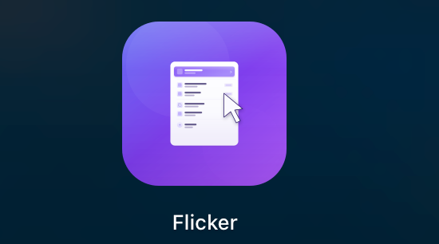

# Codex RightClick

基于 Flicker 改造的本机 Finder 右键菜单工具。

<p align="center">
  
</p>

<p align="center">
  <a href="https://www.apple.com/macos/"></a>
  <a href="https://swift.org"></a>
  <a href="LICENSE"></a>
</p>

极简的 macOS Finder 右键菜单扩展，保留日常最常用的几类操作：进入应用、复制路径、新建文件、授权写入。

## 功能

- 对文件/文件夹右键，可选择用预配置的应用程序打开。
- 复制选中项的绝对路径到剪贴板。
- 新建 TXT、Markdown、Word、Excel、PPT 文件。
- 对选中项执行用户写入授权。
- 容器 App 内配置可用应用程序列表。

## 工程结构

```
Flicker/
├── App/          # 应用入口、配置列表、添加/编辑面板、Store
├── Shared/       # AppEntry（配置模型）、SharedStore（App Group 共享读写）
└── Resources/    # Info.plist、entitlements、Assets

FlickerExtension/   # Finder Sync 扩展（FIFinderSync 子类）
script/             # 手工构建安装脚本
```

## 快速开始

### 系统要求

- macOS 14.0（Sonoma）或更高版本
- Xcode 16+（构建）

### 构建与安装

当前机器没有完整 Xcode 时，可以使用手工构建安装脚本：

```bash
./script/build_and_install_manual.sh
```

### 首次启用扩展

1. 运行容器 App。
2. 在系统设置的“登录项与扩展”里启用 Codex RightClick 扩展。
3. 脚本会重启 Finder，启用后右键即可见。

## 技术说明

- 相对路径基准为当前 Finder 窗口文件夹（`targetedURL`），无法获取时回退为绝对路径
- 配置通过 `~/Library/Application Support/CodexRightClick` 中的 JSON 文件在 App 与扩展间共享。
- 最低系统版本 macOS 14.0（Sonoma）

## 许可证

本项目基于 Flicker 改造，遵循 [MIT License](LICENSE)。
